# 🏙️ Huraymila Healthy City Platform

A fully digital healthy-city management platform built for **Huraymila, Saudi Arabia**, designed to replace all paper-based healthy-city standard submissions with a centralized, secure, and scalable MERN-based system. The platform enables government agencies to submit compliance documents, track approval status, and manage initiatives through a unified Governor dashboard. It significantly improved operational efficiency by digitizing workflows, centralizing approvals, and enabling real-time tracking across all stakeholders.

The system improved document organization and retrieval by over **70%**, increased agency standard submission efficiency by **50%**, and reduced approval review time by more than **60%** through a centralized digital workflow.

---

## 🔧 Features

### 🏛️ Government Agencies

- Upload and manage healthy-city standard compliance documents
- Track submission and approval status in real time
- View assigned standards and submission history
- Manage initiatives and registered volunteers
- Secure access with role-based permissions

### 👑 Governor Dashboard (Secure Access)

- JWT-based authentication with full system control
- Monitor overall standards progress and approval statuses
- Review, approve, or reject agency submissions
- Manage agencies, initiatives, news, and success stories
- View system-wide statistics and health indicators

### 🤝 Volunteer Module

- Register and securely log in
- Join approved initiatives
- Submit reports and success stories with file uploads
- Track personal participation history

### 📊 System Capabilities

- Centralized dashboard for standards progress tracking
- Initiative creation, approval, and lifecycle management
- Interactive health indicators (air quality, water quality, traffic accidents, etc.)
- Bilingual interface (Arabic / English)
- Dark / Light mode support
- Secure file upload and management system

---

## 💡 Impact

- Improved document organization and retrieval speed by **70%**
- Increased agency participation and submission efficiency by **50%**
- Reduced standard review and approval time by over **60%**
- Eliminated reliance on paper-based workflows entirely
- Enabled real-time visibility across all stakeholders

---

## 📦 Tech Stack

| Layer         | Tech                        |
| ------------- | --------------------------- |
| Frontend      | React.js, Vite, TailwindCSS |
| Backend       | Node.js, Express.js         |
| Database      | MongoDB                     |
| Auth          | JWT (JSON Web Tokens)       |
| File Uploads  | Multer                      |
| State & Data  | TanStack Query              |
| Maps & Charts | Leaflet, Recharts           |

---

## 🌐 Deployment Notes

- Fully responsive UI (desktop, tablet, mobile)
- RTL support for Arabic language
- Designed for scalability across multiple cities
- Cloud-ready architecture with environment-based configuration

---

## 🎬 Site Demo

**[▶ Watch walkthrough](./docs/huraymila-demo-en.mp4)**

Home sections → About → About Huraymila → news article → organizational structure → governor sign-in → agencies → standards and submissions → agency sign-in.

---

## 📸 Screenshots

<table>
  <tr>
    <td width="50%" valign="top">
      <strong>Hero</strong> 
      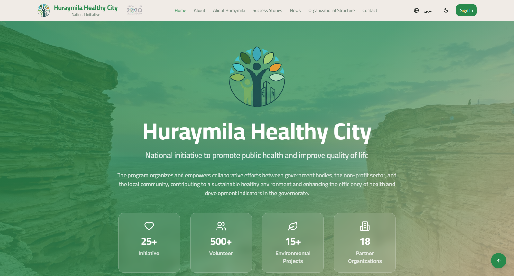
    </td>
    <td width="50%" valign="top">
      <strong>Vision</strong> 
      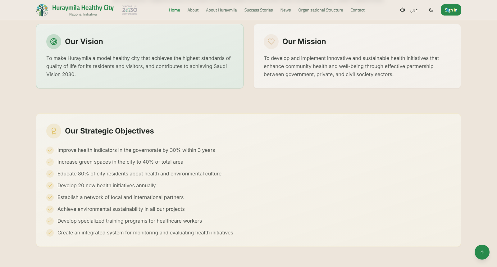
    </td>
  </tr>
  <tr>
    <td width="50%" valign="top">
      <strong>Timeline</strong> 
      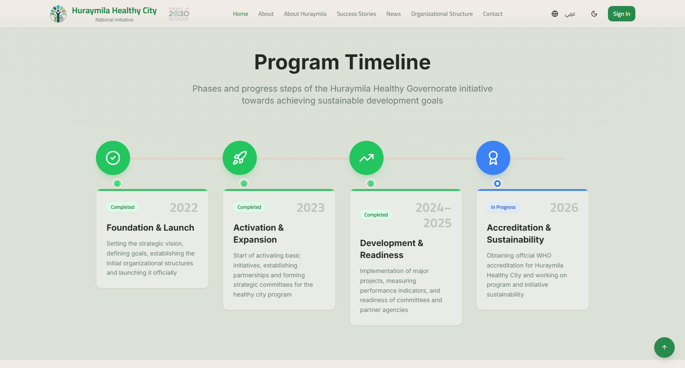
    </td>
    <td width="50%" valign="top">
      <strong>Latest News</strong> 
      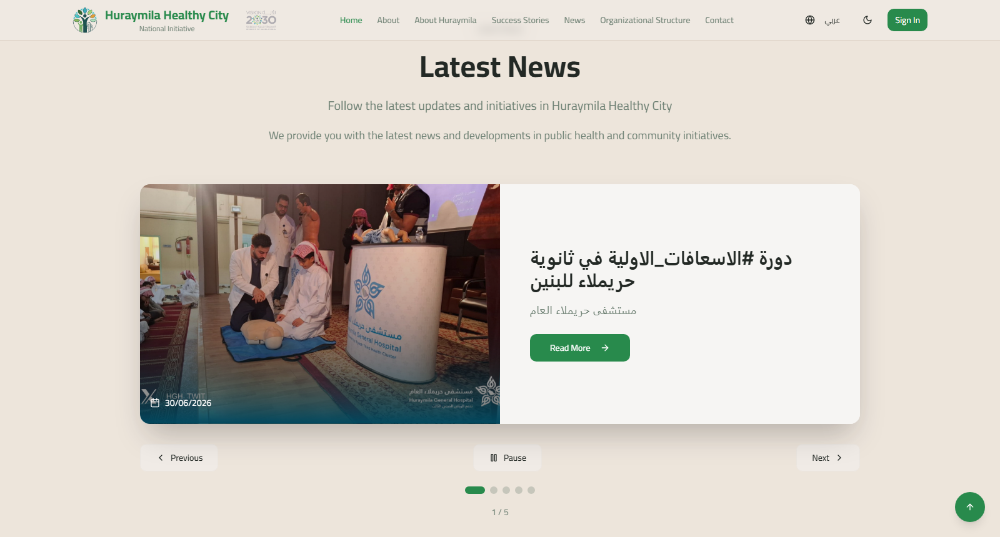
    </td>
  </tr>
  <tr>
    <td width="50%" valign="top">
      <strong>Health Indicators</strong> 
      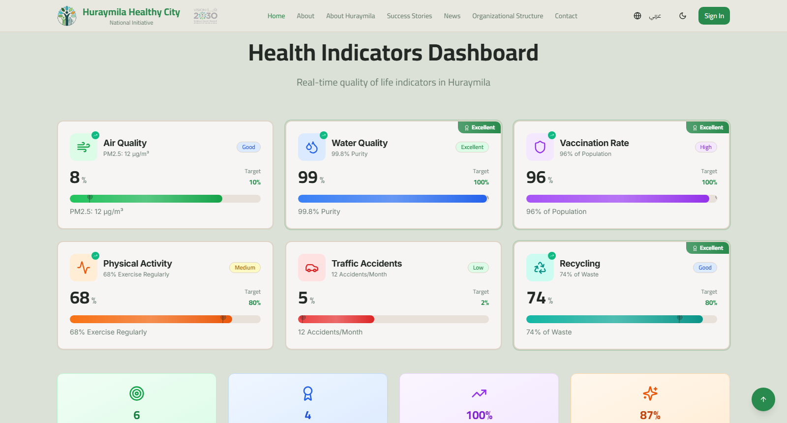
    </td>
    <td width="50%" valign="top">
      <strong>Standards Progress</strong> 
      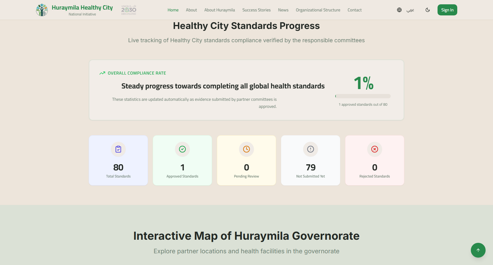
    </td>
  </tr>
  <tr>
    <td width="50%" valign="top">
      <strong>Community Network</strong> 
      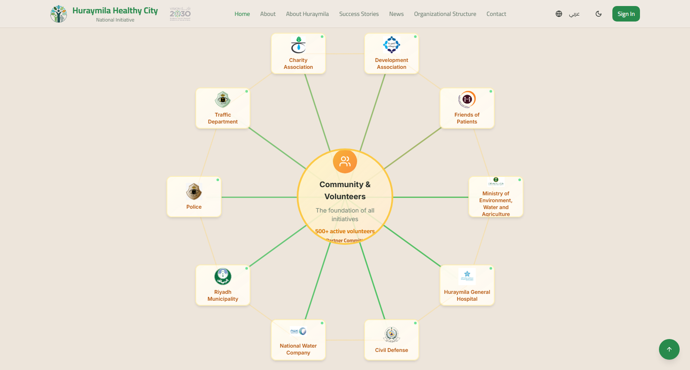
    </td>
    <td width="50%" valign="top">
      <strong>About</strong> 
      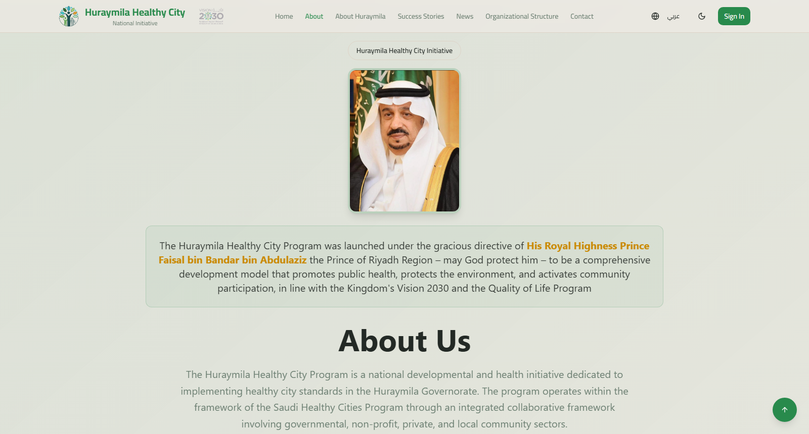
    </td>
  </tr>
  <tr>
    <td width="50%" valign="top">
      <strong>About Huraymila</strong> 
      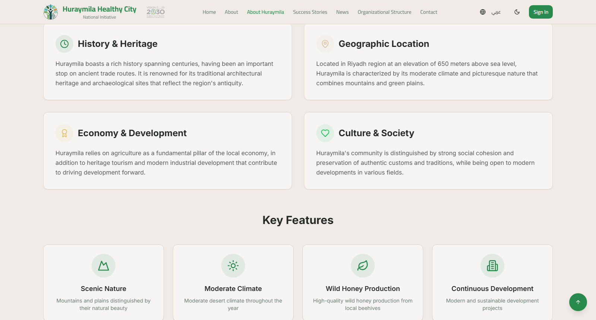
    </td>
    <td width="50%" valign="top">
      <strong>News</strong> 
      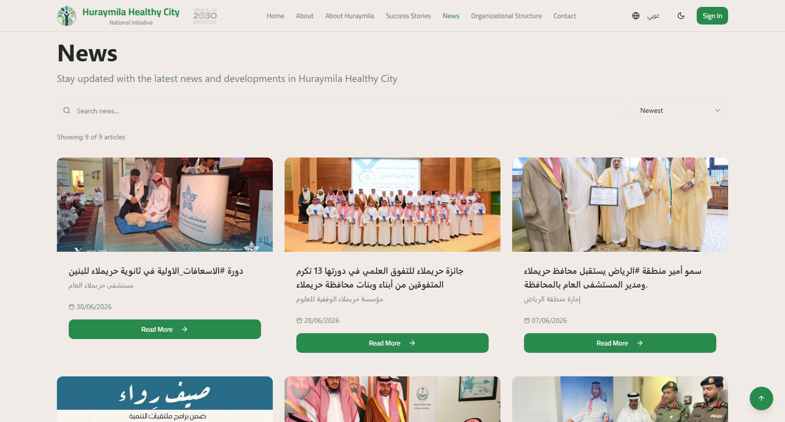
    </td>
  </tr>
  <tr>
    <td width="50%" valign="top">
      <strong>News Article</strong> 
      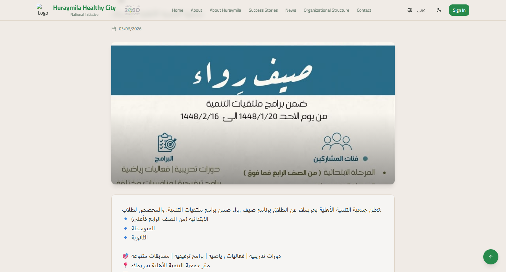
    </td>
    <td width="50%" valign="top">
      <strong>Organizational Structure</strong> 
      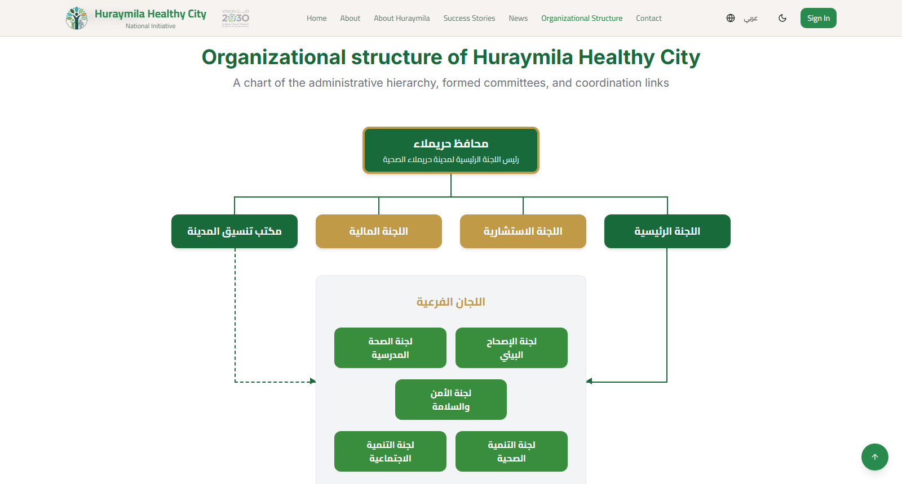
    </td>
  </tr>
  <tr>
    <td width="50%" valign="top">
      <strong>Login</strong> 
      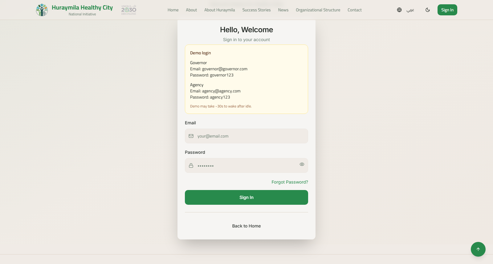
    </td>
    <td width="50%" valign="top">
      <strong>Governor Dashboard</strong> 
      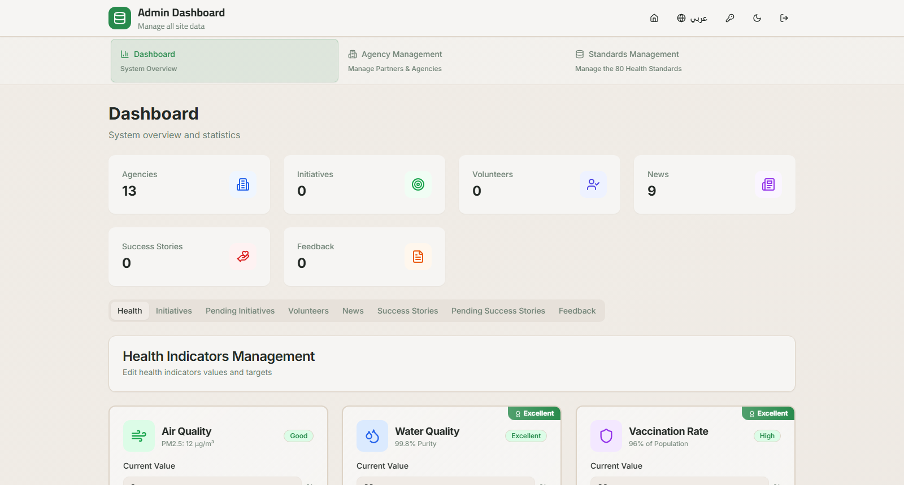
    </td>
  </tr>
  <tr>
    <td width="50%" valign="top">
      <strong>Agencies</strong> 
      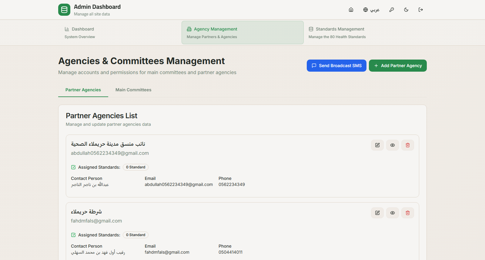
    </td>
    <td width="50%" valign="top">
      <strong>Standards</strong> 
      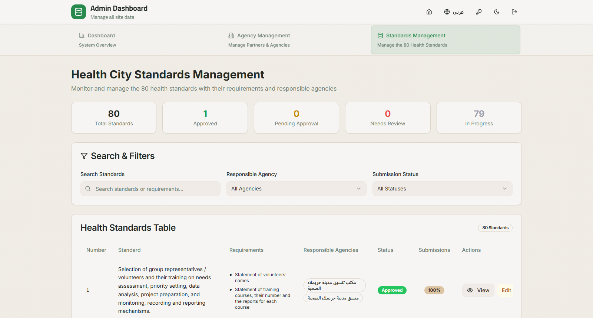
    </td>
  </tr>
  <tr>
    <td width="50%" valign="top">
      <strong>Standard Evidence</strong> 
      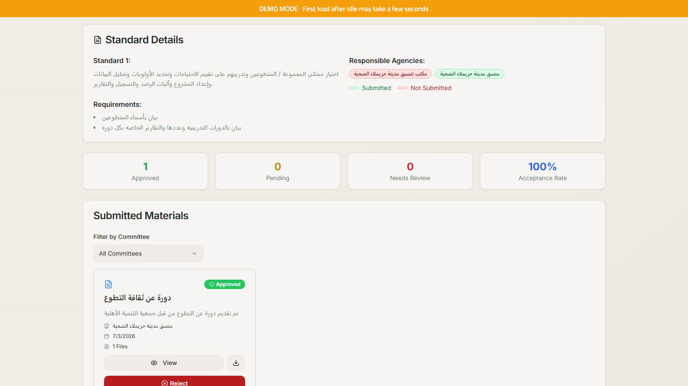
    </td>
    <td width="50%" valign="top">
      <strong>Agency Standards</strong> 
      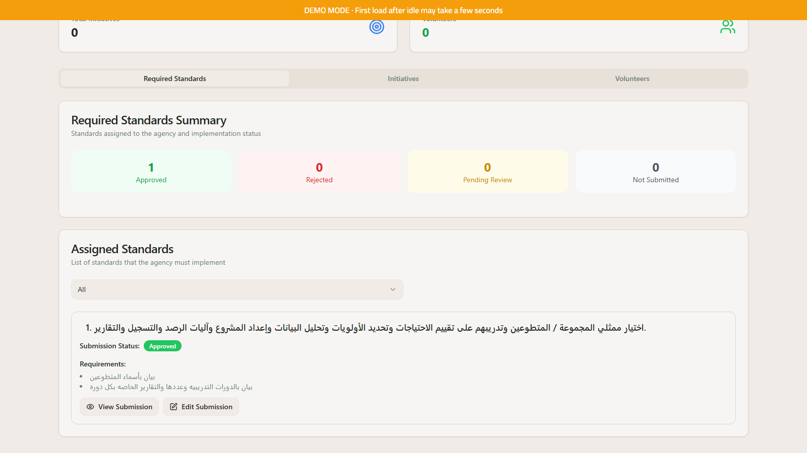
    </td>
  </tr>
  <tr>
    <td width="50%" valign="top">
      <strong>Mobile Home</strong> 
      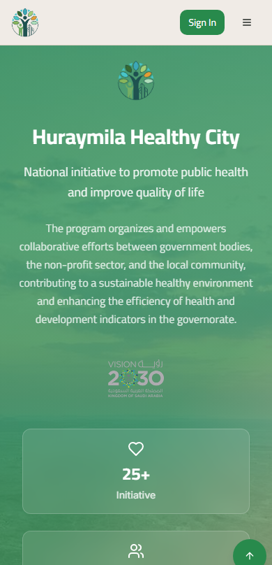
    </td>
    <td width="50%"></td>
  </tr>
</table>

---

## Live Demo 🚀

[**View Live Demo**](https://huraymila-demo.vercel.app)

| Role     | Email                 | Password    |
| -------- | --------------------- | ----------- |
| Governor | governor@governor.com | governor123 |
| Agency   | agency@agency.com     | agency123   |

---

## Author

👤 **Omar Mahmoud**
📧 [omrmhd54@gmail.com](mailto:omrmhd54@gmail.com)
💼 [LinkedIn](https://www.linkedin.com/in/omrmhd5/)
🌐 [Portfolio](https://omarmahmoud.dev/)
🔗 [GitHub](https://github.com/omrmhd5)
